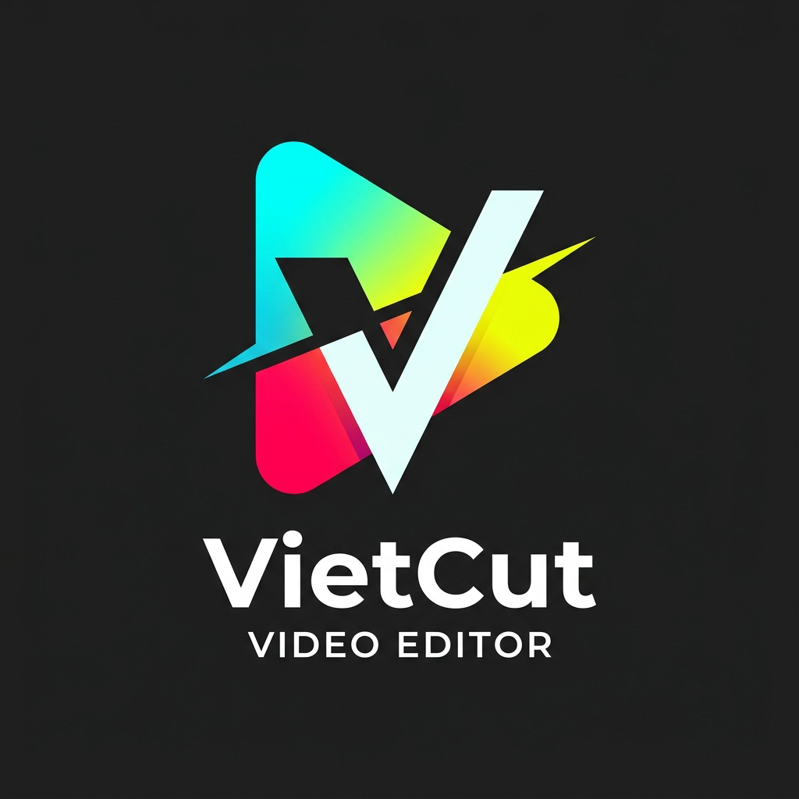

# VietCut 🎬

### Phần Mềm Cắt Ghép & Chỉnh Sửa Video Miễn Phí Dành Cho Người Việt

[-0078D6?style=for-the-badge&logo=windows)](https://github.com/maiductuan/vietcut/raw/main/VietCut.msi)

---

### 📥 TẢI VỀ CÀI ĐẶT NGAY

| Gói Tải Về | Loại Tệp | Dung lượng | Tải Xuống Trực Tiếp |
| :--- | :---: | :---: | :---: |
| **Bản Cài Đặt Khuyên Dùng (Installer)** | `.msi` | **3.2 MB** | [⬇️ **Tải VietCut.msi**](https://github.com/maiductuan/vietcut/raw/main/VietCut.msi) |
| **Bản Chạy Ngay Portable (Không cần cài)** | `.exe` | **5.6 MB** | [⬇️ **Tải VietCut.exe**](https://github.com/maiductuan/vietcut/raw/main/VietCut.exe) |

---

## ✨ Tính Năng Nổi Bật

- 🎯 **Chuẩn WYSIWYG 100%**: Màn hình xem trước (Preview) và video xuất ra là một, đảm bảo không bị lệch khung hình hay sai font chữ.
- 🎞️ **Biên tập Timeline nhiều lớp**: Thao tác cắt, tách, ghép nhiều track video, hình ảnh, âm thanh và phụ đề dễ dàng.
- 🎨 **Bộ lọc màu & Hiệu ứng chuyển cảnh**: Điều chỉnh độ sáng, tương phản, bão hòa, tông màu cùng các hiệu ứng chuyển cảnh tự nhiên.
- 📝 **Tạo phụ đề & chữ động**: Hỗ trợ xoay, phóng to thu nhỏ, tạo nền và căn lề chuyên nghiệp.
- ⚡ **Siêu nhẹ & Tốc độ cao**: Sử dụng công nghệ hiện đại, dung lượng cài đặt chưa tới 10MB, khởi động tức thì.
- 🔒 **An toàn & Riêng tư**: Hoạt động 100% Offline trên máy của bạn, không thu thập dữ liệu cá nhân hay video.

---

## 🚀 Hướng Dẫn Cài Đặt

1. **Bước 1**: Bấm vào nút [⬇️ **Tải VietCut.msi**](https://github.com/maiductuan/vietcut/raw/main/VietCut.msi) ở bảng phía trên để tải bộ cài.
2. **Bước 2**: Nhấp đúp chuột vào file `VietCut.msi` vừa tải về để tiến hành cài đặt.
3. **Bước 3**: 
   > 💡 **Lưu ý nhỏ về Windows Defender / SmartScreen**:  
   > Vì đây là phiên bản phần mềm độc lập mới phát hành chưa mua chứng chỉ số doanh nghiệp Microsoft đắt tiền, nếu Windows hiện thông báo xanh *"Windows protected your PC"*:  
   > 👉 Nhấn vào chữ **More info** (Thông tin thêm) ➔ Chọn **Run anyway** (Vẫn chạy).
4. Mở biểu tượng **VietCut** trên màn hình Desktop và bắt đầu sáng tạo video!

---

## 💻 Yêu Cầu Cấu Hình

- **Hệ điều hành**: Windows 10 hoặc Windows 11 (64-bit).
- **RAM**: Tối thiểu 4 GB (Khuyên dùng 8 GB trở lên).
- **Ổ cứng trống**: Tối thiểu 200 MB.
- **WebView2**: Đã được tích hợp sẵn trên hầu hết các máy Windows 10/11 hiện nay.

---

  Phát triển với ❤️ vì cộng đồng sáng tạo nội dung Việt Nam.

